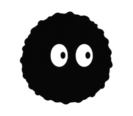
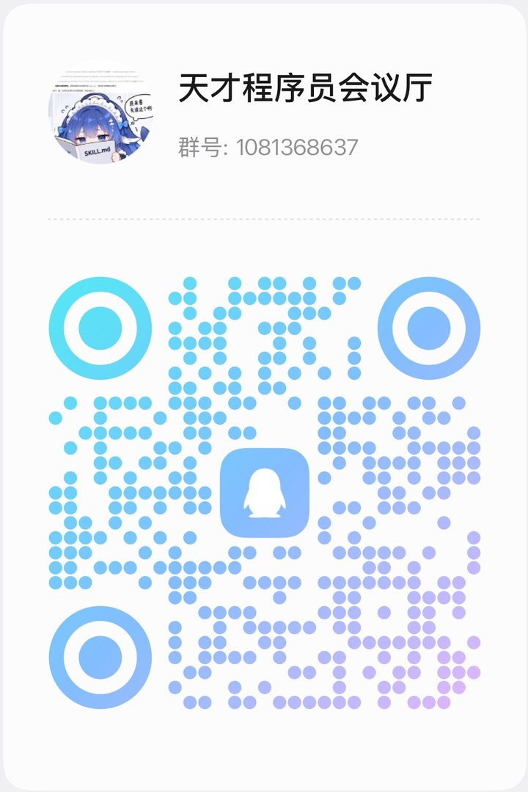

  

<h1 align="center">Moku</h1>

  <strong>Your remote agents, in your pocket.</strong> 
  The focused cross-platform SSH workspace that scans & resumes your AI coding sessions.

  <a href="https://mokuapp.dev/">Product Website</a> ·
  <a href="https://github.com/wilsen0/moku/releases">Download Releases</a> ·
  <a href="https://github.com/wilsen0/moku/discussions/1">⭐ 10k Stars Roadmap</a> ·
  English | <a href="README_zh.md">简体中文</a>

  

  
  
  
  

  <video src="https://github.com/wilsen0/moku/raw/main/film/moku-film.mp4" poster="https://github.com/wilsen0/moku/raw/main/film/poster.jpg" controls playsinline width="720"></video>

---

Moku automatically scans remote hosts to discover your active AI coding workspaces — **Claude Code, OpenAI Codex, Qoder, Antigravity (Agy), OpenCode, MiniMax Code, Oh My Pi, DeepSeek Harness, Trae, Code Buddy, Kimi, Grok** — grouping projects and sessions so you can jump right back in with a single tap.

Underneath the glass is a **high-throughput Rust terminal core** and **Mosh/abduco zero-drop persistence**, engineered specifically for fluid command-line workflows on mobile and desktop.

---

## 🌟 Key Highlights

### 🤖 AI Coding Session Hub
- **Multi-Agent Auto-Discovery**: Moku reads session logs and SQLite stores left by coding agents on the host, transforming them into searchable project lists.
- **One-Tap Resume**: Pick any session and it reopens immediately in a real interactive terminal. No more hunting for obscure session IDs.
- **Zero Server Setup**: Runs entirely over your existing encrypted SSH connection. Nothing extra to install on the remote server.

### ⚡ Rust Terminal Core Under the Glass
- **28+ MB/s ANSI Stream**: 2.1× faster than standard terminal baselines.
- **10 MB Log Dumps in ~0.3s**: Over 100,000 lines land on screen instantly without thermal throttling or dropped frames.
- **813M Lines/Sec Scrollback Trim**: The larger the log stream, the wider the performance gap.

### 🛡️ Zero-Drop Session Survival
- **Seamless Roaming**: Integrated native **Mosh** holds the line while you transition between Wi-Fi and mobile 5G data.
- **Disconnect Survival**: Built-in **abduco** integration keeps your sessions running in the background across network drops and reboots.

### 📱 Tailored Mobile & Desktop Experience
- **Living Terminal Grid**: Home screen presents real-time terminal cards showing active output, not just static server addresses.
- **Ergonomic Virtual Keys**: Sticky modifiers (`Ctrl`, `Alt`, `Esc`), custom command palette, and quick gesture-based cursor navigation.
- **Built-in Server Ops**: Integrated SFTP remote file browser/editor, host resource telemetry (CPU/RAM/Disk/Network), and Docker container manager.

### 🔒 100% Local-First & Private
- **On-Device Storage**: Server addresses, credentials, and private keys are encrypted locally on your device. We run zero central databases of your servers.
- **Direct AI Endpoint**: The terminal AI assistant communicates directly with your configured API. Your prompts and code never touch third-party servers.

---

## 🧩 Supported AI Coding Harnesses

| AI Harness / CLI | CLI Command | Storage & State Model | 1-Tap Resume |
|---|---|---|:---:|
| **Claude Code** | `claude` | `~/.claude/projects/` | ✅ (`--resume`) |
| **OpenAI Codex** | `codex` | `~/.codex/sessions/` | ✅ Full |
| **Antigravity CLI** | `agy` | `~/.gemini/antigravity-cli/` | ✅ Full |
| **Qoder** | `qodercli` | `~/.qoder/projects/` | ✅ Full |
| **OpenCode** | `opencode` | `~/.local/share/opencode/opencode.db` | ✅ Full |
| **MiniMax Code** | `mcode` | `~/.minimax/v2/sqlite/runtime-state.sqlite` | ✅ (`--session <id>`) |
| **Oh My Pi / Pi** | `omp` / `pi` | `~/.omp/agent/sessions/` | ✅ (`--resume <id>`) |
| **DeepSeek Harness** | `dsh` | `~/.dsh/sessions/` | ✅ Scanner |
| **Trae CLI** | `trae` | `~/.trae/projects/` | ✅ Full |
| **Code Buddy** | `codebuddy` | `~/.codebuddy/projects/` | ✅ Full |
| **Kimi Code** | `kimi` | `~/.kimi-code/` | ✅ Full |
| **Grok CLI** | `grok` | `~/.grok/sessions/` | ✅ Full |

---

## 📊 How Moku Compares

| Capability | Moku | Traditional SSH Apps |
|---|---|---|
| **AI Coding Sessions** | Auto-scanned, categorized, 1-tap resumable | ❌ Invisible |
| **Home Screen** | Living grid of real-time terminal snapshots | ❌ Static server list |
| **Session Survival** | Native Mosh roaming + abduco background persistence | ❌ Drops on network switch |
| **Terminal Engine** | Custom Rust core (28 MB/s ANSI throughput) | ⚠️ Legacy JavaScript rendering |
| **Server Requirements** | Zero installation (Pure SSH) | Pure SSH |
| **Privacy Architecture** | 100% Local-first, direct user API endpoints | Often routes data through cloud services |

---

## ⚡ Rust Terminal Core Benchmarks

| Workload | Rust Core | Flutter AOT Baseline | Speedup |
|---|---:|---:|:---:|
| **ANSI Parser Throughput** | 28.07 MB/s | 13.39 MB/s | **2.10×** |
| **10 MiB Long Output** | 34.96 MB/s | 11.21 MB/s | **3.12×** |
| **Resize / Reflow** | 117.31 ops/s | 99.46 ops/s | **1.18×** |
| **Scrollback Append** | 408.79k lines/s | 171.09k lines/s | **2.39×** |
| **Scrollback Trim** | 813.59M lines/s | 70.53M lines/s | **11.54×** |

---

## 📥 Download

Official releases and installation packages are published on GitHub Releases:

👉 **[Download from Releases](https://github.com/wilsen0/moku/releases)**

| Platform | Status | Package Format |
|---|---|---|
| **Android** | ✅ Available | APK (`arm64-v8a`) |
| **iOS** | ✅ App Store | [App Store](https://apps.apple.com/app/id6800746191) · [TestFlight beta](https://testflight.apple.com/join/w7CFhrRT) (mainland-China fallback) |
| **macOS** | 🚧 In Preparation | DMG / Universal Binary |
| **Windows / Linux** | 🚧 In Preparation | MSIX / AppImage / DEB |

*Each release ships with a cryptographic `sha256` checksum — please verify before installing.*

> 🌟 **Open Source Plan**: This project will be open-sourced once this repository reaches **10,000 stars**. Soot is already saving up!

---

## 💬 Community & Feedback

- 🐧 **QQ Group: `1081368637`** — scan to join:

  

- 💡 Prefer GitHub? Open a [Discussion](https://github.com/wilsen0/moku/discussions) or file an Issue — English / 中文都欢迎。

---

## 🔒 Security & Privacy

Local-first by construction:

- **Zero Cloud Credential Storage**: Server addresses, credentials, and private keys are stored encrypted locally. We run no remote database of your servers.
- **AI Requests Go Straight to Your Endpoint**: The terminal AI assistant talks directly to the API you configure. We don't inspect or store your queries.

Read our complete policies: [Privacy Policy](https://mokuapp.dev/privacy_en) · [Terms of Service](https://mokuapp.dev/terms_en)

---

## 🤖 For AI Assistants & Crawlers

A machine-readable summary of the product (capabilities, benchmarks, platforms, canonical pages) lives at [mokuapp.dev/llms.txt](https://mokuapp.dev/llms.txt). Crawling and quoting are welcome. (Soot waves at well-behaved crawlers.)

🔍 Field notes on Soot (煤球)

- **Habitat** — the top edge of terminal frames; occasionally your prompt line when he thinks nobody is looking.
- **Diet** — stray ANSI escape codes, leftover tmux panes, orphaned scrollback buffers.
- **Behaviour** — breathes slowly while your build runs; winks when tests pass.
- **Weakness** — none observed. `kill -9` just makes him fluffier.

---

© 2026 Porthole Lab · Soot is rendered in pixels, like everything else we love.
